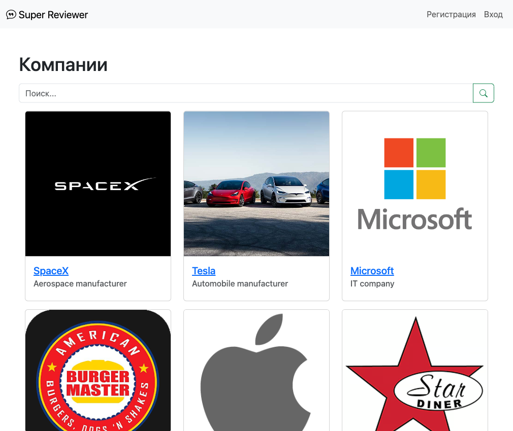
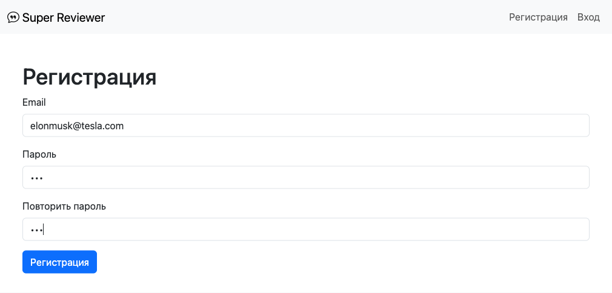
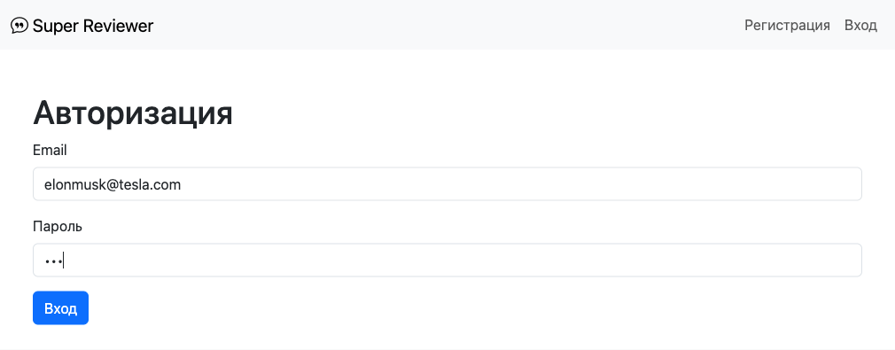
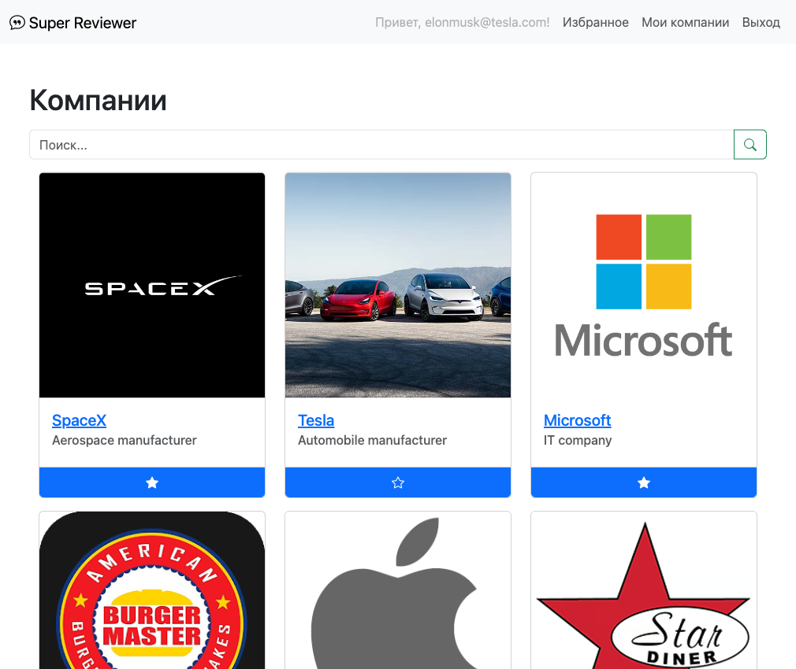
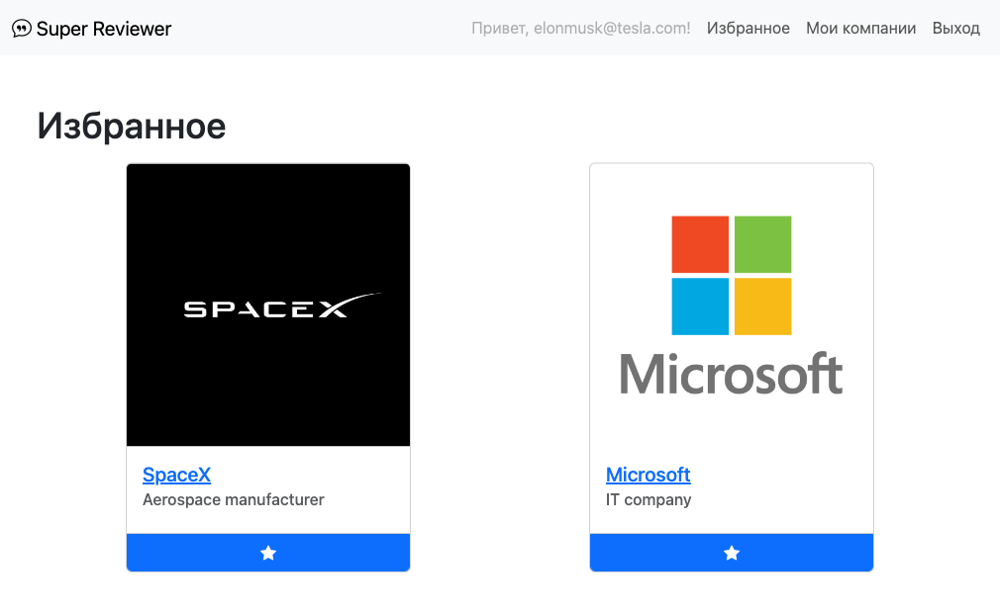
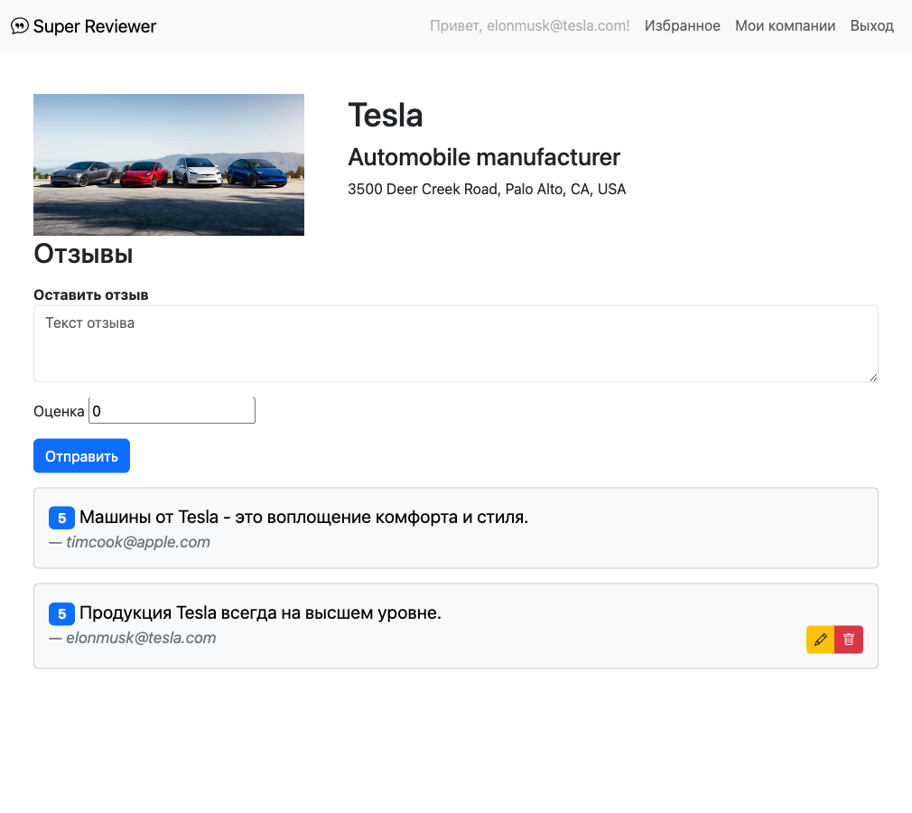
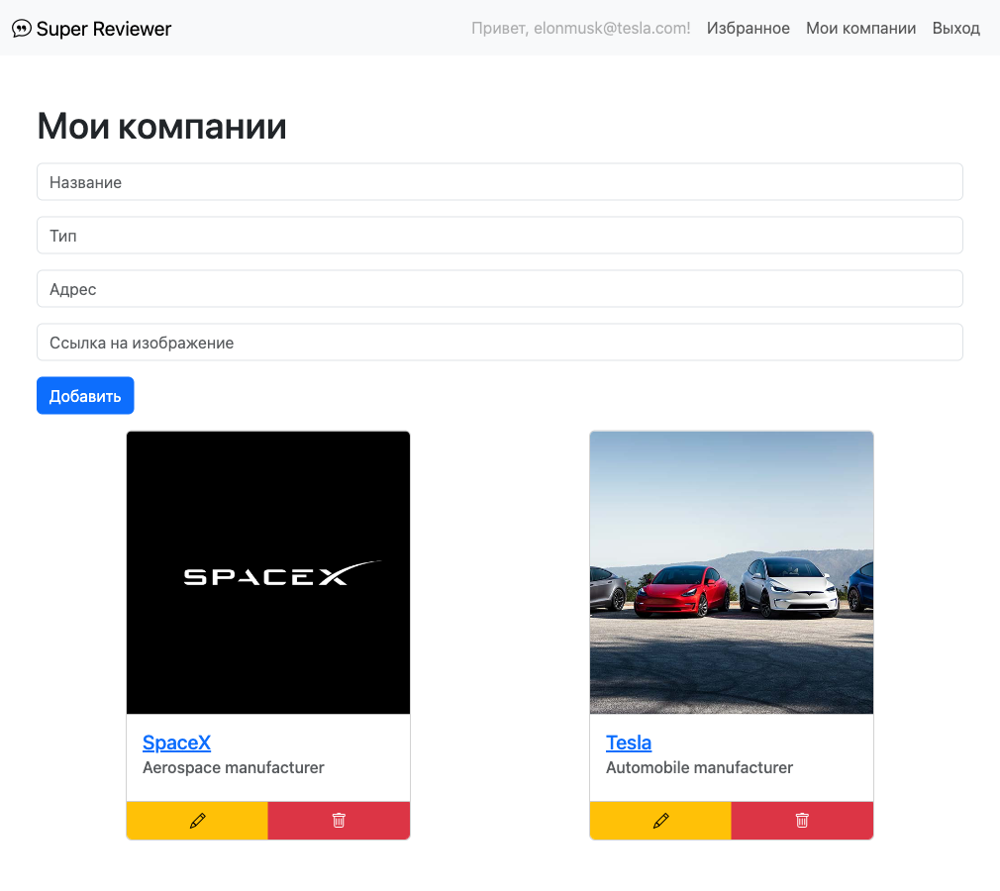

# Big Cool Task

Сейчас ты начнёшь работу над своим первым большим проектом. Это будет сайт где зарегистрированные пользователи смогут добавлять свои компании, а другие пользователи смогут оставлять на эти компании отзывы. Также мы реализуем возможность добавлять компании к себе в избранное.

## Задачи

Тебе предстоит разработать весь этот проект шаг за шагом дополняя его функциональность. Задачи на каждый день лежат в папке [tasks](./tasks/).

## Тесты

Каждый кусочек, который ты будешь разрабатывать покрыт юнит-тестами. Каждый день тебе нужно будет добиваться того, чтобы новый набор юнит-тестов проходил успешно. Тесты лежат в папке [test](./test/). Перед запуском тестов убедись, что твоей сервер запущен на 3000 порту.

Чтобы запустить не все тесты сразу, а только один, введи в командной строке: `npm test test/211.test.js` (если нужно запустить тесты только для первого дня). При этом если ты делаешь тесты для какого-то дня то тесты для предыдущих дней не должны ломаться.

**Тесты изменять нельзя!**

## Подробное описание проекта

На главной странице пользователя должен встречать список уже зарегистрированных компаний:

<kbd>

</kbd>

Пользователь может зарегистрироваться:

<kbd>

</kbd>

Или войти под своим уже существующим аккаунтом:

<kbd>

</kbd>

После того как пользователь заходит под своим аккаунтом он может добавлять компании в избранное с главной страницы:

<kbd>

</kbd>

Список избранных компаний можно будет просмотреть со страницы "Избранное":

<kbd>

</kbd>

На странице компании можно увидеть более подробную информацию о ней. Также на этой страницы пользователь может увидеть отзывы на компанию, а также оставить, отредактировать или удалить свой отзыв.

<kbd>

</kbd>

На странице "Мои компании" пользователь может добавить свою компанию. Также на этой странице он может просмотреть список своих компаний, отредактировать или удалить любую из них.

<kbd>

</kbd>

**А теперь приступай к заданиям в папке [tasks](./tasks/). Удачи!**
