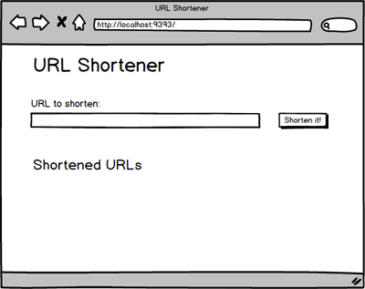
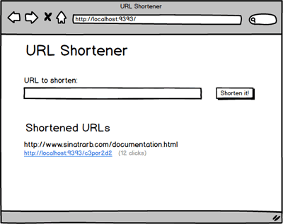

# URL Shortener

## Введение
Тебе предстоит создать клон [Bitly]. Что такое `Bitly`? URL могут быть очень длинными, из-за чего ими неудобно делиться. `Bitly` предоставляет сервис, который создает короткие и более удобные URL. Когда пользователь переходит по короткому `Bitly` URL, сервер отвечает тем, что производит редирект на изначальный, более длинный URL.

Попробуй. Нажми на эту ссылку: [https://bit.ly/2DXRTOG](https://bit.ly/2DXRTOG).

Что случилось? Если откроешь вкладку `Network` в `Developer Tools` и снова перейдешь по `Bitly` ссылке, то увидишь, что ответ от сервера `Bitly` имеет статус [301][wikipedia 301]. 
Если ты чуть углубишься и посмотришь на заголовки ответа, то заметишь, что заголовок `location` показывает куда нужно будет перейти браузеру.

Во время разработки данного веб-приложения сфокусируйся на маршрутах `Express` и моделях `Sequelize`.

В данном проекте нам не обойтись без БД. А не забыл ли ты, что у нас есть замечательный инструмент под названием [sequelize-cli](https://sequelize.org/master/manual/migrations.html), который позволяет развернуть инфраструктуру БД в считанные секунды?

## Release 0: MVP

  
*Рис 1*.  Макет приложения

На Рис. 1 изображена анимация, которая демонстрирует, как твое приложение должно выглядеть. На главной странице расположена форма, куда пользователь вводит URL. Когда форма отправлена, приложение сохраняет объект, представляющий URL. Объекты-URL представлены на главной странице и в первоначальном, и в сокращенном виде. Когда пользователь переходит по короткому  URL, он перенаправляется на первоначальный адрес.

Для приложения тебе понадобится модель `Url`. У модели будет два атрибута: длинный и короткий URL. Создавать эти объекты ты будешь на основе пользовательского ввода. Пользователи предоставляют длинный URL. Ты должен создавать короткий URL перед сохранением объекта.

*Замечание:*  Необходимые маршруты уже прописаны, но мы должны завершить и заполнить их.

## Release 1: Запрос cчётчика для каждого короткого URL

Пользователи рады твоему сервису по сокращению URL, но они запрашивают дополнительный функционал. Когда они делятся сокращенной ссылкой, им хочется знать, сколько раз этой ссылкой воспользовались.

Нам надо обновить наше приложение, чтобы знать сколько раз переходили на каждый URL, имеющийся в БД. Чтобы это сделать, нам нужно ...

- Изменить базу данных, чтобы следить за количеством визитов каждого URL.
- Изменить подходящий обработчик маршрута так, чтобы в любой момент, когда вызывается короткий URL, обновлялся счетчик для конкретного URL.
- Модифицировать главную страницу так, чтобы отображать количество вызовов каждого короткого URL ([mockup](readme-assets/counter.png)).

## Release 2: Валидация URL и обработка ошибок
Ты получил отзыв, в котором сказано, что твои короткие ссылки не работают и отправляют пользователей на неправильные URL. Мы посмотрели отчет об ошибке и заметили, что пользователи вводят неполные URL. Например, пользователь вводит "google.com" вместо "http://google.com". Другими словами, проблема в пользовательском вводе, но выглядит это так, будто проблема на твоей стороне и, конечно, тебе нужно что-то с этим сделать.

Если пользователь отправляет невалидный URL, тебе не надо предоставлять ему короткую ссылку; вместо этого его нужно предупредить о проблеме и показать, как можно исправить ввод (см Рис 2). Чтобы сделать это, добавь [Sequelize validation](https://sequelize.org/master/manual/validations-and-constraints.html) к модели `Url`. Можно несколькими способами определить, из чего состоит валидный URL. Для данной цели, давай договоримся, что валидный URL начинается с `http://` или `https://`.

Добавь `Sequelize validation` к модели `Url`, чтобы проверять, что URL начинается с `http:/` или `https://`.

  
*Рис 2*.  Предупреждение пользователя о невалидном URL

Валидация в `Sequelize` - это проверки на уровне JavaScript. Если произойдет ошибка на уровне валидации, то SQL-запрос не будет отправлен в базу данных.
это middleware, который срабатывает перед сохранением объекта. Если валидация не пройдена, объект не получится сохранить, и ошибки будут содержаться в объекте ValidatorError. У такого объекта есть атрибуты  kind, path, value, и message. В некоторых случаях появляется свойство reason. Необходимо разобраться с тем, как пользоваться валидаторами и что происходит при проверке объекта.

## Заключение

После завершения этого задания, ты должен уметь разбираться с жизненным циклом объекта `Sequelize`: валидация, сохранение, обновление, удаление и так далее. Ты должен уметь обрабатывать эти действия. В этом задании ты добавил функцию, которая срабатывает перед тем, как объект `Url` сохраняется, чтобы получить короткий URL. Круто, если ты сделал это через `presave`.

Также нужно уметь предоставить хороший интерфейс для пользователей, когда случается ошибка. Например, в этом задании ты создаешь объекты  `Url` из ввода пользователя. Но ты должен учесть тот факт, что иногда пользователи вводят некорректные данные. Ты обновил обработчик маршрутов, так что теперь, если что-то пойдет не так, то пользователь будет уведомлен об ошибке и получит подсказку, как можно её исправить.

[Bitly]: http://bitly.com/
[HTTP status codes]: https://ru.wikipedia.org/wiki/%D0%A1%D0%BF%D0%B8%D1%81%D0%BE%D0%BA_%D0%BA%D0%BE%D0%B4%D0%BE%D0%B2_%D1%81%D0%BE%D1%81%D1%82%D0%BE%D1%8F%D0%BD%D0%B8%D1%8F_HTTP
[Wikipedia 301]: https://ru.wikipedia.org/wiki/HTTP_301
